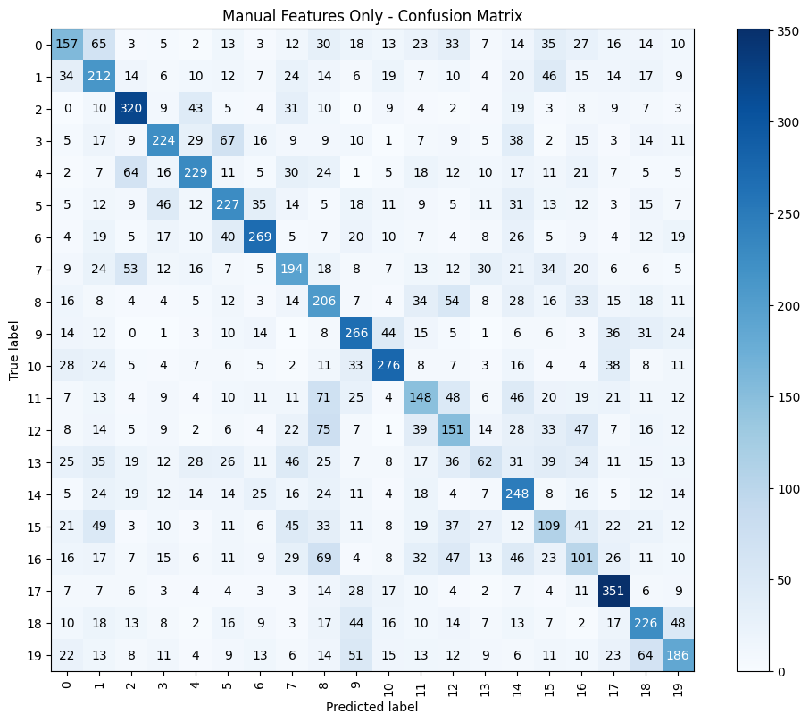
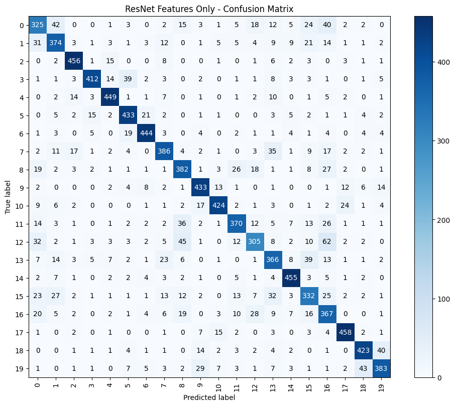
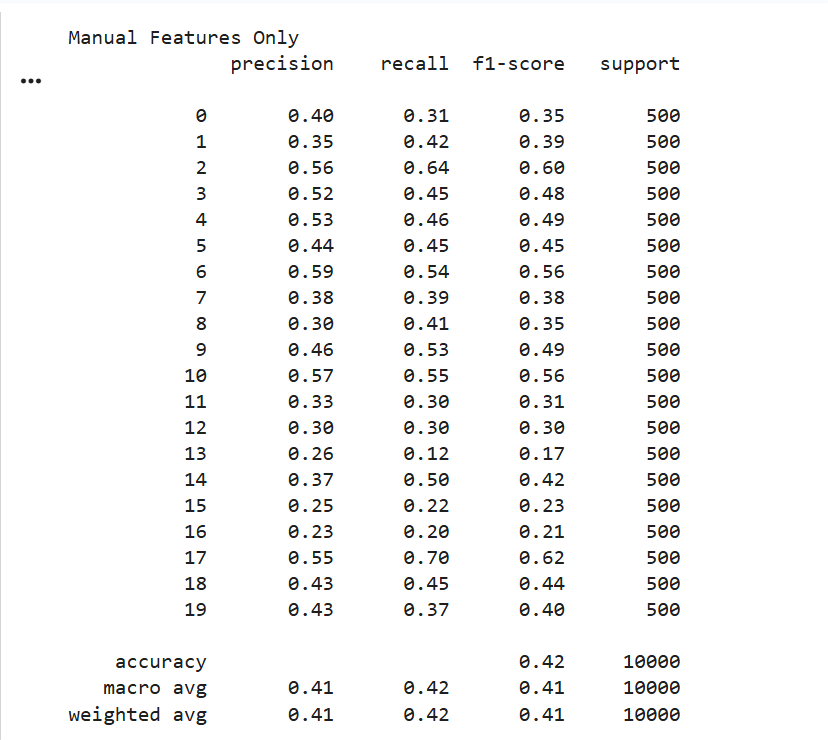
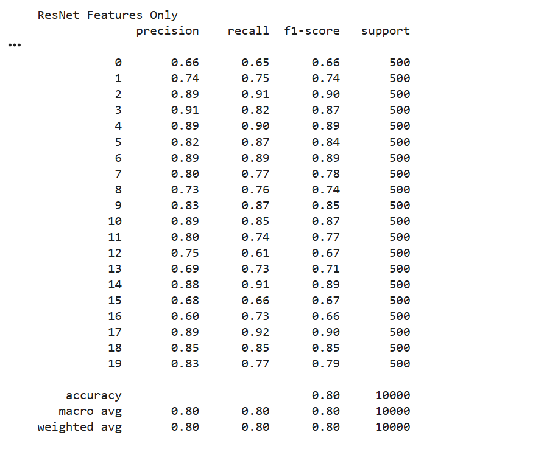
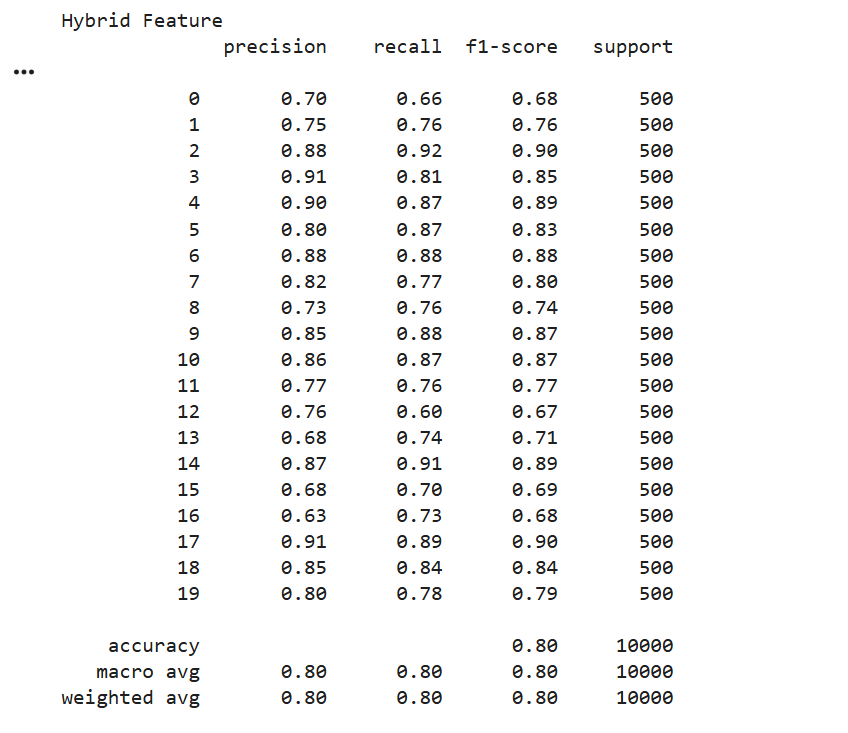
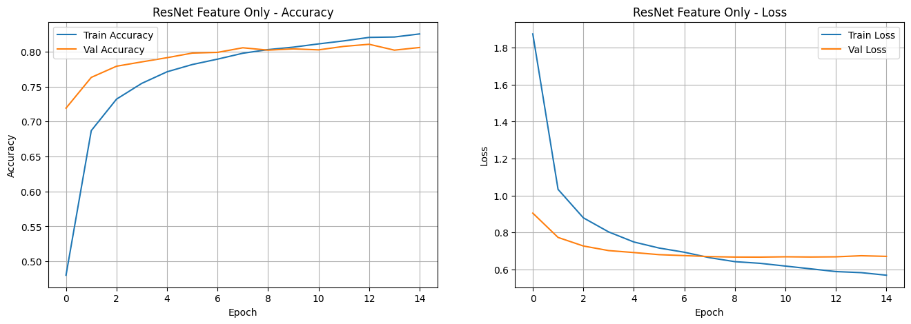
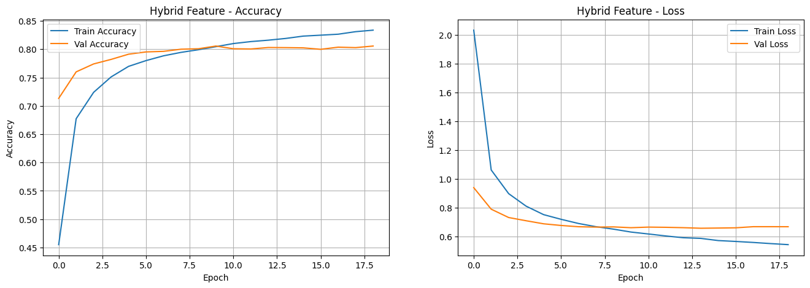

# 🖼️ Hybrid Feature Extraction for CIFAR-100 Classification

[](https://www.python.org/)
[](https://www.tensorflow.org/)
[](https://streamlit.io/)

## 📝 Project Overview: Synergizing Classical and Deep Features

This project addresses the challenging task of **Image Classification** on the **CIFAR-100 dataset (Coarse Labels)**, which involves discriminating between 20 distinct object categories. The core contribution is the implementation of a **Hybrid Feature Extraction (HFE)** framework designed to enhance model robustness and performance by fusing complementary information derived from two distinct paradigms: **traditional computer vision** and **deep convolutional networks**.

The HFE method effectively captures:

1. **Local and Global Spatial Information** (via manual features).
2. **High-level Semantic Content** (via deep embeddings).

This synergistic approach, followed by **Principal Component Analysis (PCA)** for optimal dimensionality reduction, demonstrates a measurable performance gain compared to using either feature set in isolation, ultimately validating the strategic combination of domain-specific expertise and generalized deep representations.

### 🚀 Live Demo

You can interact with the live deployed classification application here:

**[CIFAR-100 Hybrid Classification Model Demo](https://cifar100classificationhybridmodel.streamlit.app/)**

---

## 🔬 Technical Methodology and Feature Pipeline

The classification pipeline utilizes a three-pronged comparative study, culminating in the optimized hybrid approach.

### 1. Manual Feature Extraction Pipeline

Images are resized to $32 \times 32$ pixels and three standardized, complementary feature descriptors are calculated and concatenated to form the manual feature vector:

* **HOG (Histogram of Oriented Gradients):** Used to capture object **structural shape and boundary information** by localizing intensity gradient distributions.
* **LBP (Local Binary Pattern):** Used to encode local **image texture and micro-patterns**, offering resilience to monotonic gray-scale changes.
* **HSV Color Histogram:** Used to quantify the **global distribution of color** components (Hue, Saturation, Value), providing features invariant to lighting variations.

### 2. Deep Feature Extraction Pipeline

* **Transfer Learning with ResNet-50:** The images are resized to $224 \times 224$ pixels and processed using a pre-trained **ResNet-50** network (weights initialized from ImageNet).
* The model is used as a **fixed feature extractor**. The output is taken from the **Global Average Pooling (GAP)** layer, yielding a highly compressed, high-level semantic embedding vector ($1 \times 2048$ dimensions).

### 3. Optimized Hybrid Feature Fusion and Classification

This phase involves the fusion and optimization of the extracted feature sets:

| Step | Component | Purpose |
| :--- | :--- | :--- |
| **Normalization** | `StandardScaler` | Applied independently to both the Manual and ResNet feature sets to ensure uniform scaling. |
| **Concatenation** | Feature Fusion | The normalized manual and deep feature vectors are concatenated. |
| **Dimensionality Reduction** | `PCA` | Applied to the combined vector to reduce the feature space to **300 components**. The fitted `pca_hybrid.pkl` object is deployed for consistent inference. |
| **Classification Model** | **MLP Classifier** | A **Multi-Layer Perceptron** network with a three-layer dense architecture is trained on the final 300-component hybrid feature vector for the 20-class prediction. |

---

## 📊 Performance and Experimental Results

The experimental evaluation confirms the hypothesis that feature complementarity boosts performance. The optimal model, trained on the **300-component hybrid vector**, achieves significantly higher accuracy and balanced performance.

### Comparative Summary

| Feature Extraction Approach | Test Accuracy | F1-Score (Weighted Avg.) | Note |
| :-------------------------- | :-----------: | :-----------------------: | :--- |
| Manual Features Only (HOG, LBP, HSV) | 43.57% | [Manual F1 Score] | Baseline performance using classical descriptors. |
| Deep Learning Only (ResNet50 Embeddings) | 79.77% | [ResNet F1 Score] | Strong baseline from state-of-the-art representation learning. |
| **Hybrid Fusion (Manual + ResNet50)** | **81.17%** | **[Hybrid F1 Score]** | **Optimal Performance:** Demonstrated an **absolute gain of +1.40%** over the deep-learning-only method. |

### 1. Analysis of Prediction Errors (Confusion Matrix)

The Confusion Matrices below visualize the reduction of classification errors (*off-diagonal values*) as the feature complexity increases, demonstrating the efficacy of the fusion strategy.

#### Manual Features Only
* **Insight:** The sparse diagonal and high off-diagonal values indicate significant confusion, confirming the limitations of classical features alone on this complex dataset.


#### ResNet Features Only
* **Insight:** A visible improvement in the diagonal shows the power of semantic features. However, misclassifications persist between semantically similar classes.


#### Optimal: Hybrid Features
* **Insight:** The diagonal is maximized, and off-diagonal errors are visibly reduced compared to the ResNet-only model. This validates that the inclusion of manually engineered features significantly **reduces inter-class confusion**.


### 2. Analysis of Per-Class Balance (F1-Score Plots)

F1-Score provides a robust assessment of the balance between Precision and Recall for each of the 20 coarse classes. The sequential plots showcase the uniform boost in reliability provided by the hybrid approach.

#### Manual Features F1-Score


#### ResNet Features F1-Score


#### Optimal: Hybrid Features F1-Score
* **Insight:** The Hybrid approach achieves the **highest and most consistent F1-Scores** across the majority of classes, proving the robust and balanced generalization capability of the **300-component** feature vector.


### 3. Training Stability (Accuracy and Loss Curves)

These plots demonstrate the stability and efficiency of the training process for each model. The stable convergence of the Hybrid model supports the high quality of the feature input.

#### Manual Features Learning Curve


#### ResNet Features Learning Curve


#### Optimal: Hybrid Features Learning Curve
* **Insight:** The **Hybrid model** shows excellent training characteristics: both Training and Validation Accuracy converge smoothly, and Loss decreases steadily with minimal gap, indicating **negligible overfitting** and high feature stability.


---

## 🛠️ Technology Stack and Dependencies

* **Python (3.10+)**
* **TensorFlow/Keras**
* **Streamlit**
* **scikit-learn**
* **scikit-image**
* **OpenCV (`cv2`)**

---

## 📁 Repository Structure

The project is structured to separate research and deployment components, with all evaluation assets located in the `assets/` directory:

```bash
📂 cifar100-hybrid-classifier
│
├── 📂 assets                   # All evaluation plots and Confusion Matrices.
│
├── app.py                      # Streamlit application script for inference and deployment.
├── requirements.txt            # List of all Python dependencies.
│
├── 📂 deployment               # Folder containing trained model artifacts and scalers.
│     ├── hybrid_model.keras    # The final trained MLP classifier model.
│     ├── scaler_manual.pkl     # Fitted StandardScaler object for manual features.
│     ├── scaler_resnet.pkl     # Fitted StandardScaler object for ResNet features.
│     └── pca_hybrid.pkl        # Fitted PCA object for dimensionality reduction (300 components).
│
└── 📂 notebook                 # Folder containing the research, training, and evaluation code.
      └── CV_CIFAR100.ipynb     # Full Jupyter Notebook detailing the entire HFE pipeline, training, and evaluation.
```

🚀 Getting Started Follow these steps to set up and run the Streamlit application locally. 1. Clone the Repository Use the following command to clone the project repository:
```bash
git clone [https://github.com/colinwilson06/Hybrid-CIFAR100-Classifier.git](https://github.com/colinwilson06/Hybrid-CIFAR100-Classifier.git)
cd Hybrid-CIFAR100-Classifier
```

2. Install Dependencies Install all required libraries specified in requirements.txt:
```bash
pip install -r requirements.txt
```

3. Run the Streamlit Application Execute the app.py file to launch the web interface for image classification:
```bash
streamlit run app.py
```

The application will automatically launch in your default web browser, enabling immediate testing of the hybrid model.
